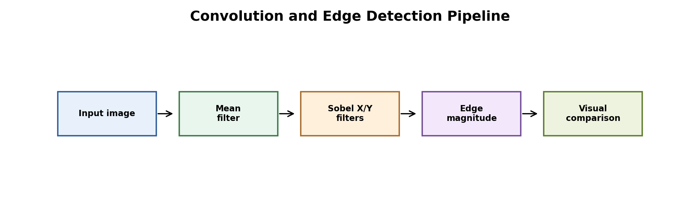
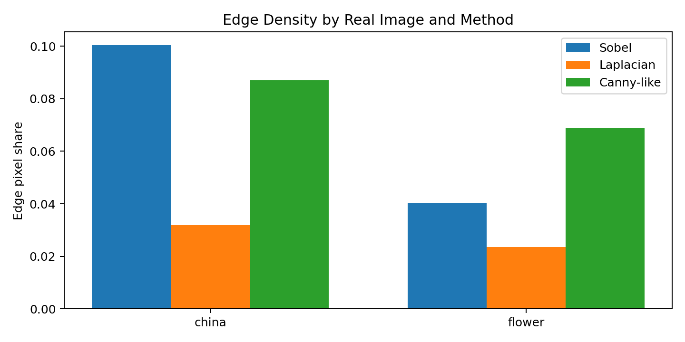
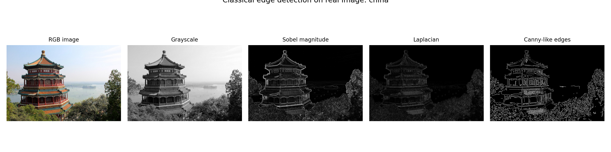
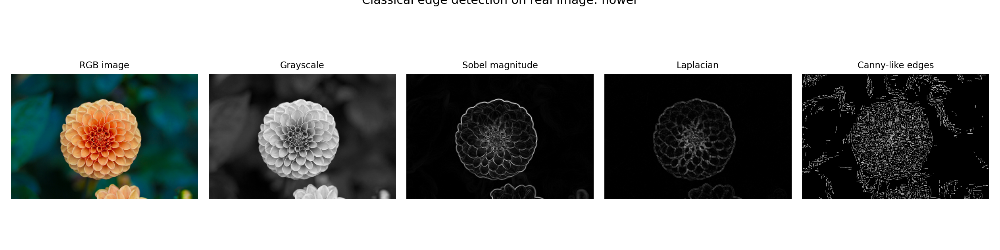

# Real-Image Edge Detection with Classical Filters



Figure: real photos are converted to grayscale, filtered with classical edge operators, and compared with edge-density metrics.

## Motivation

Classical edge detection is still important because it explains the basic visual idea behind many computer vision systems: boundaries often appear where pixel intensity changes sharply.

## Project Goal

We applied convolution-based edge detection to real images and compared Sobel, Laplacian, and Canny-like edge maps.

## Dataset

We used the real sample photos included with scikit-learn:

- `china`: outdoor scene with buildings, sky, and objects
- `flower`: close-up flower image with smoother background

Both images are RGB photos with size 427x640.

## Tools

Python, NumPy, pandas, matplotlib, and scikit-learn.

## Method

We implemented convolution from scratch. The pipeline converts RGB images to grayscale, smooths the image, applies Sobel and Laplacian filters, and builds a Canny-like edge map using non-maximum suppression and hysteresis.

## Results

| Image | Sobel Edge Density | Laplacian Edge Density | Canny-like Edge Density |
|---|---:|---:|---:|
| China | 0.1004 | 0.0318 | 0.0871 |
| Flower | 0.0403 | 0.0235 | 0.0688 |







## Interpretation

The China image has higher Sobel edge density because it contains more scene boundaries, object outlines, and texture changes. The flower image is smoother, so fewer pixels become strong Sobel edges.

The Canny-like method keeps thinner connected edges after suppression and hysteresis. This makes it more selective than raw Sobel magnitude.

## Conclusion

This project demonstrates classical filtering on real images. The main lesson is that edge detectors are simple, interpretable tools for measuring local image structure, but their output depends strongly on image texture, threshold choice, and smoothing.

## How To Run

```bash
pip install -r requirements.txt
python 1_real_image_edge_detection.py
```
